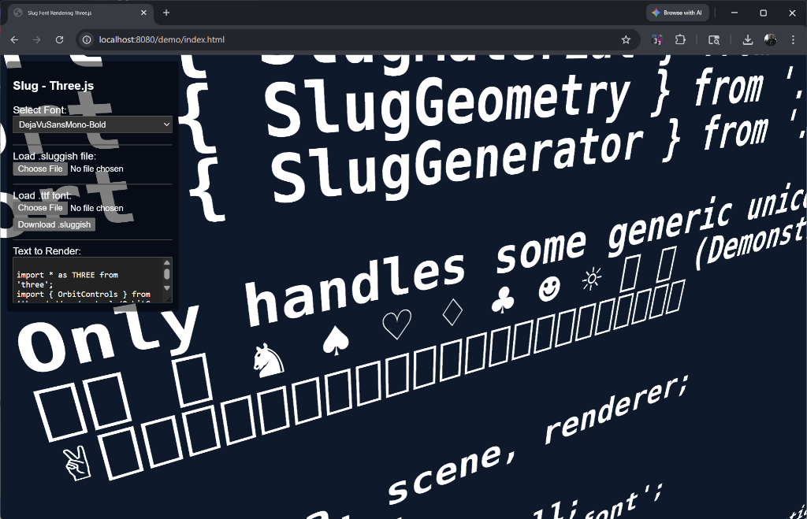

# JSlug: Three.js Font Rendering Pipeline

JSlug is a Javascript and WebGL port of Eric Lengyel's **Slug** font rendering algorithm, implemented for **Three.js**.

Unlike traditional MSDF (Multi-Channel Signed Distance Field) font rendering which can suffer from corner rounding and texture resolution limits, the Slug algorithm evaluates the quadratic bezier curves of the TrueType font directly within the fragment shader. This enables resolution-independent font rendering, sharp corners, and precise anti-aliasing.

## Screenshots

## Features

- **Client-side Generation**: Parses `.ttf` and `.otf` data dynamically using `opentype.js` to compute curve layouts and spatial binning locally.
- **Binary Format**: Serializes curves and bin maps to `.sluggish` file payloads for cache delivery.
- **Instanced Rendering**: Passes coordinate frames and glyph indexing variables to WebGL vertex attributes backends.
- **Typography Alignment**: Iterates layout structures utilizing metric scalars mapping direct width increments.

## Usage

1. Serve the repository locally (e.g., `npx http-server`).
2. Open `demo/index.html`.
3. Use the UI to load a standard `.ttf` file. The Javascript generator will parse the curves, initialize the GPU textures, and render the text mesh.
4. (Optional) Click **Download .sluggish** to cache the generated font data to a serialized binary.

## Credits & Acknowledgements

*   **Eric Lengyel** for the [Slug Algorithm](http://sluglibrary.com/).
*   **The Sluggish C++ Port** for providing the architectural reference for mapping Slug textures directly to generic WebGL buffer pipelines.
*   **[opentype.js](https://github.com/opentypejs/opentype.js)** for providing the native Javascript TrueType parsing core.
*   Ported to Javascript and Three.js by **[manthrax](https://github.com/manthrax)**.
